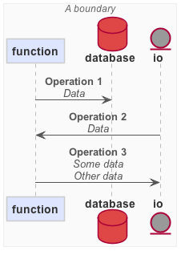

# DataFlow

Generate graphs and diagrams describing data flows.

## Getting Started

```
cabal install dataflow@0.6.0.0
```

## Usage

The following declarations is supported by DataFlow.

<!--- Not Ruby code, but use Ruby code highlighter for .flow code -->

```ruby
boundary 'Title' { ... }
io identifier 'Title'
function identifier 'Title'
database identifier 'Title'
identifier -> identifier 'Operation' 'Data Description'
```

These are used inside a `diagram { ... }`.

## Example

```ruby
diagram 'Webapp' {
  boundary 'Browser' {
    function client 'Client'
  }
  boundary 'Amazon AWS' {
    function server 'Web Server'
    database logs 'Logs'
  }
  io analytics 'Google<br/>Analytics'

  client -> server 'Request /' ''
  server -> logs 'Log' 'User IP'
  server -> client 'Response' 'User Profile'
  client -> analytics 'Log' 'Page Navigation'
}
```

## Output Formats

### DFD


```bash
dataflow dfd webapp.flow | dot -Tpng > webapp.png
```

#### Outputs


### Sequence Diagram



You can use [PlantUML](http://plantuml.sourceforge.net/) to generate a sequence
diagram.

```bash
dataflow seq webapp.flow | java -Djava.awt.headless=true -jar plantuml.jar -tsvg -pipe > webapp.svg
```

#### Output


## Setup

```bash
cabal sandbox init # optional
cabal install --only-dependencies --enable-tests
cabal configure --enable-tests
```

## Build

```bash
cabal build
```

## Install

If you initialized a sandbox the executable will end up in the sandbox, i.e.
`.cabal-sandbox/bin/dataflow`. If you have no sandbox it will end up in
`~/.cabal/bin/dataflow`.

```bash
cabal install
```

## Tests

```bash
./run-tests.sh
# or...
./watch-tests.sh
```

## Building the Examples

```bash
make -C examples
```

## Release

```bash
cabal clean && cabal build && cabal sdist &&
```

That outputs a `dist/dataflow-*.tar.gz` that can be distributed.
