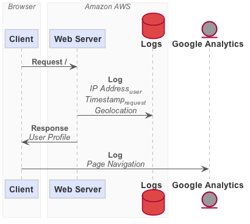

# DataFlow

Render graphs using a declarative markup. Currently supports DFD
(http://en.wikipedia.org/wiki/Data_flow_diagram) and sequence diagrams
(http://plantuml.sourceforge.net/sequence.html).


## Usage

### Objects

The following forms are supported by DataFlow.

#### IDs

An ID can contain letters, numbers and underscores. It must start with a
letter.

<!--- Not dot code, but use dot code highlighter for .flow code -->
```dot
my_id_contain_4_words
```

#### Strings

String literals are written using double quotes.

```dot
"this is a string and it can contain everything but double quotes and newlines"
```

**NOTE!** Escaping characters inside strings is not supported at the moment.

#### Text Blocks

Text blocks are special strings, enclosed in backticks, that are can span
multiple lines in the source document. The space characters before the first
non-space characters on each line are trimmed, regardless of the indentation.
Linebreaks inside the text block are preserved.

```dot
`this is
      a
  textblock`
```

... would render as:

```
this is
a
textblock
```

#### Attributes

Attributes are key-value pairs for diagrams and objects that are used by
output renderers. Attributes are enclosed by curly brackets. For objects that
can contain other objects, attributes and child objects can be mixed.

Keys have the same rules as IDs. Values can be strings or text blocks.

```dot
{
  key1 = "attr value"
  key2 = `attr
          value`
}
```

#### `diagram`

`diagram` is the top-level form and must appear exactly once in a DataFlow
document. It can contain attributes and objects.

```dot
diagram {
  title = "My diagram"
}
```

#### `boundary`

The `boundary` form declares a TrustBoundary object that can contain
attributes and other objects.

```dot
diagram {
  boundary {
    title = "My System"
  }
}
```

#### `io`, `function`, `database`

The `io`, `function` and `database` forms declare `InputOutput`, `Function` and
`Database` objects, respectively. The objects have IDs and they can contain
attributes. Empty attribute brackets can be omitted.

```dot
diagram {
  io thing1

  io thing2 {
    title = "Thing 2"
  }
}

```

#### `->`

The `->` form declares a `Flow` object between the objects referenced by their
IDs. It can contain attributes. Empty attribute brackets can be omitted.

Note that the arrow can be reversed as well (`<-`).

```dot
diagram {
  thing1 -> thing2

  thing1 <- thing2 {
    operation = "Greet"
    data = "A nice greeting"
  }
}
```

### Example

```dot
diagram {
  title = ""

  boundary {
    title = "Browser"

    function client {
      title = "Client"
    }
  }

  boundary {
    title = "Amazon AWS"

    function server {
      title = "Web Server"
    }
    database logs {
      title = "Logs"
    }
  }
  io analytics {
    title = "Google Analytics"
  }

  client -> server {
    operation = "Request /"
  }
  server -> logs {
    operation = "Log"
    data = `The user
            IP address.`
  }
  server -> client {
    operation = "Response"
    data = "User Profile"
  }
  analytics <- client {
    operation = "Log"
    data = "Page Navigation"
  }
}
```

### DFD


To use the *DFD* output you need [Graphviz](http://www.graphviz.org/) installed.

```bash
dataflow dfd webapp.flow | dot -Tpng > webapp.png
```
#### Output


### Sequence Diagram


You can use [PlantUML](http://plantuml.sourceforge.net/) to generate a sequence
diagram.

```bash
dataflow seq webapp.flow | java -Djava.awt.headless=true -jar plantuml.jar -tpng -pipe > webapp.png
```

#### Output



### Makefile Example

The following Makefile finds `.flow` sources in `src` and generates DFDs, in
SVG format, in `dist`.

```make
SOURCES=$(shell find src/*.flow)
TARGETS=$(SOURCES:src/%.flow=dist/%.dfd.svg)

K := $(if $(shell which dataflow),,$(error "No dataflow executable in PATH. See https://github.com/SonyMobile/dataflow for install instructions)))"))

dist/%.dfd.svg: src/%.flow
	@dataflow dfd $< | dot -Tsvg > $@

dfd: $(TARGETS)

clean:
  rm -f $(TARGETS)
```

## Build Instructions

See [BUILD.md](BUILD.md).

## License

BSD-3, see [LICENSE](LICENSE).
