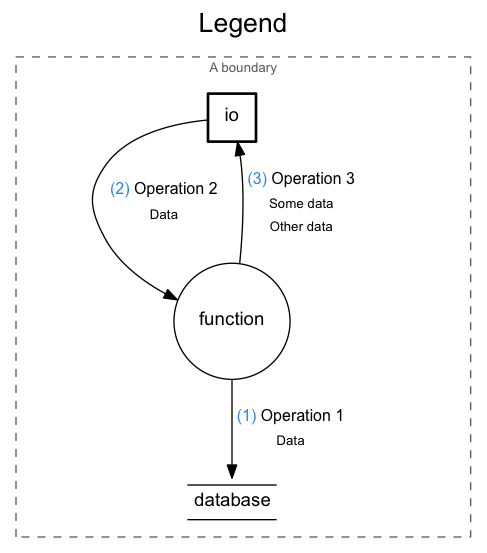

# DataFlow Usage

The following declarations is supported by DataFlow.

<!--- Not Ruby code, but use Ruby code highlighter for .flow code -->

```ruby
boundary 'Title' { ... }
io identifier 'Title'
function identifier 'Title'
database identifier 'Title'
identifier -> identifier 'Operation' 'Data Description'
```

These are used inside a `diagram { ... }`.

## Example

```ruby
diagram 'Webapp' {
  boundary 'Browser' {
    function client 'Client'
  }
  boundary 'Amazon AWS' {
    function server 'Web Server'
    database logs 'Logs'
  }
  io analytics 'Google<br/>Analytics'

  client -> server 'Request /' ''
  server -> logs 'Log' 'User IP'
  server -> client 'Response' 'User Profile'
  client -> analytics 'Log' 'Page Navigation'
}
```

## DFD



```bash
dataflow dfd webapp.flow | dot -Tpng > webapp.png
```
### Output


## Sequence Diagram


You can use [PlantUML](http://plantuml.sourceforge.net/) to generate a sequence
diagram.

```bash
dataflow seq webapp.flow | java -Djava.awt.headless=true -jar plantuml.jar -tpng -pipe > webapp.png
```

### Output


## Makefile Example

The following Makefile finds `.flow` sources in 'src' and generates DFD in SVG
format in`dist`.

```make
SOURCES=$(shell find src/*.flow)
TARGETS=$(SOURCES:src/%.flow=dist/%.dfd.svg)

K := $(if $(shell which dataflow),,$(error "No dataflow executable in PATH. See https://github.com/SonyMobile/dataflow for install instructions)))"))

dist/%.dfd.svg: src/%.flow
	@dataflow dfd $< | dot -Tsvg > $@

dfd: $(TARGETS)

clean:
  rm -f $(TARGETS)
```
